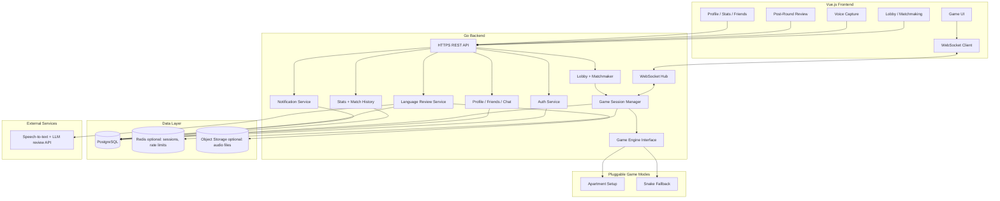
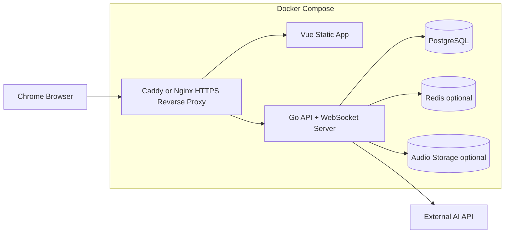
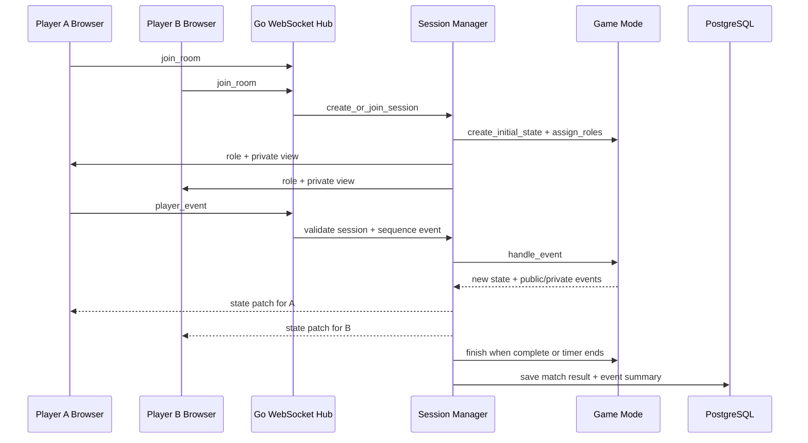
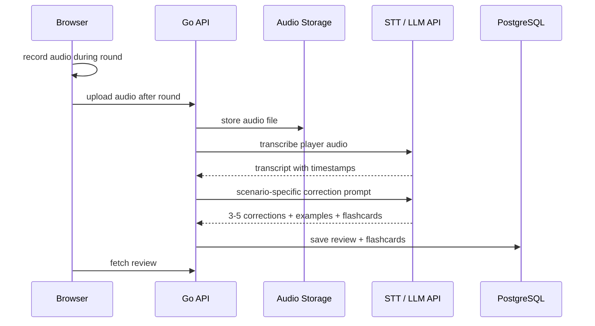
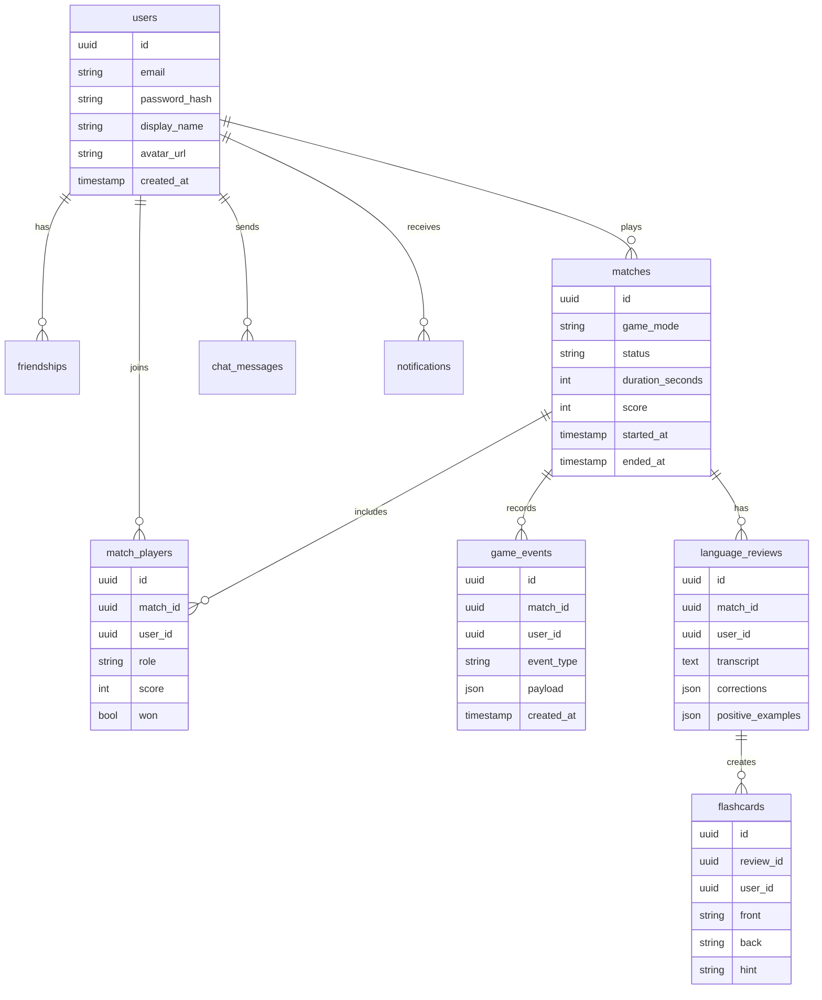

# Architecture and Module Plan

## Recommendation

Build the first version as a **2D real-time cooperative language game** in Vue.js + Go.

Do not start with Three.js for the MVP. Three.js is impressive, but it makes the hardest parts harder: camera, assets, object picking, mobile layout, performance, and visual polish. Your core risk is not graphics. Your core risk is whether asymmetric co-op gameplay makes people speak German naturally.

The safest product direction is:

- one modular web game platform
- one main game mode: `Apartment Setup`
- real-time two-player sessions
- voice recording during the round
- post-round transcript review and flashcards
- a simple fallback game mode, such as Snake, plugged into the same game/session architecture

This gives the team a serious project while keeping the escape hatch realistic.

## First Game Choice

Prefer **Apartment Setup** as the first playable game.

Reasons:

- It naturally trains German prepositions, objects, colors, imperatives, and clarification.
- It can be implemented with drag-and-drop and semantic placement checks.
- It does not need cooking timers, ingredient transformations, recipes, inventory, or station logic.

## System Architecture



## Deployment Architecture



Use Docker Compose from the start. The evaluator should be able to run the project with one command.

## Backend Module Layout

Suggested Go layout:

```text
backend/
  cmd/api/
    main.go
  internal/
    auth/
    users/
    friends/
    chat/
    lobby/
    realtime/
    game/
      engine.go
      session.go
      events.go
      modes/
        apartment/
        snake/
    review/
    stats/
    notifications/
    db/
    config/
```

The key package is `internal/game`. It should not know German-specific rules directly. It should run sessions, route events, enforce timing, and call the selected game mode.

## Game Mode Interface

Each game mode should implement the same conceptual contract:

```go
type GameMode interface {
    ID() string
    CreateInitialState(config MatchConfig) (GameState, error)
    AssignRoles(players []Player) ([]PlayerRole, error)
    HandleEvent(state GameState, event PlayerEvent) (GameState, []GameEvent, error)
    ValidateState(state GameState) ValidationResult
    Finish(state GameState) RoundResult
}
```

This is what makes the fallback realistic.

`Apartment Setup` and `Snake` can both become modes under the same platform:

- same auth
- same lobby
- same matchmaking
- same WebSocket transport
- same match history
- same stats
- same tournament wrapper
- same spectator wrapper

Only the game-specific state and event rules change.

## Real-Time Event Flow



## Voice and AI Flow



Keep correction after the round. Do not interrupt the live game with grammar feedback.

## Minimal Database Model



## Frontend Module Layout

Suggested Vue layout:

```text
frontend/
  src/
    app/
    router/
    api/
    stores/
      auth.ts
      lobby.ts
      game.ts
      voice.ts
    components/
      ui/
      layout/
      game/
      chat/
      review/
    games/
      apartment/
      snake/
    pages/
      Login.vue
      Lobby.vue
      GameRoom.vue
      Review.vue
      Profile.vue
      Privacy.vue
      Terms.vue
```

## Transcendence Points Plan

Target exactly the required **14 points** with modules that support the actual product.

| Module | Type | Points | How this project satisfies it |
|---|---:|---:|---|
| Use a framework for both frontend and backend | Major | 2 | Vue.js frontend + Go backend framework such as Gin, Echo, or Fiber |
| Real-time features using WebSockets | Major | 2 | Live lobby, game state sync, role-specific state patches |
| User interaction system | Major | 2 | Profiles, friends, chat, invites |
| Standard user management and authentication | Major | 2 | Email/password auth, hashed passwords, sessions/JWT |
| Web-based game where users play against each other | Major | 2 | Two-player asymmetric co-op game |
| Remote players, real-time | Major | 2 | Players connect from different browsers/devices |
| Game statistics and match history | Minor | 1 | Store completed matches, scores, roles, review history |
| Gamification system | Minor | 1 | XP, achievements, streaks, language badges |
| **Total** |  | **14** |  |

This is the recommended core plan.

## Optional Bonus / Stretch Modules

Only count these after the 14 points are solid.

| Module | Type | Points | Risk |
|---|---:|---:|---|
| AI opponent for games | Major | 2 | Medium. Easier for Snake than language co-op. |
| Voice/speech integration | Minor | 1 | Good fit. You already want voice recording and transcription. |
| Tournament system | Minor | 1 | Good fit if you add brackets or scheduled rooms. |
| Spectator mode | Minor | 1 | Good fit because WebSocket sessions can broadcast read-only views. |
| PWA | Minor | 1 | Low/medium risk, but not important early. |
| Custom design system | Minor | 1 | Reasonable if you build 10+ reusable Vue UI components. |
| Monitoring with Prometheus/Grafana | Major | 2 | Good engineering module, but more DevOps work. |

## Fallback Plan

If the language game becomes too hard, keep the platform and switch the game mode.

Fallback should not mean throwing away the architecture.

What stays:

- Vue frontend shell
- Go backend
- auth
- profiles
- friends/chat
- lobby
- WebSocket session server
- match history
- stats
- achievements
- Docker deployment

What changes:

- `games/apartment` becomes secondary
- `games/snake` becomes the main evaluated game
- Snake uses the same session lifecycle and real-time event transport

Snake can still satisfy:

- web-based game where users play against each other
- remote players
- real-time WebSockets
- stats and match history
- tournament
- spectator mode
- AI opponent, if needed

## Build Order

1. Create Docker Compose with Vue, Go, PostgreSQL, and HTTPS proxy.
2. Implement auth, users, and protected API routes.
3. Implement lobby and WebSocket room join.
4. Implement the generic game session manager.
5. Implement `Apartment Setup` with hardcoded scenario data.
6. Save match history and basic stats.
7. Add chat/friends/profile.
8. Add post-round voice upload and review.
9. Add achievements/XP.
10. Add `Snake` as a fallback or second game mode.

## Decision Summary

Use **2D Vue game screens**, not Three.js, for the MVP. Keep the architecture modular around `GameMode`, so your ambitious language game and a fallback Snake game both run on the same platform.

The project should be presented as a real-time multiplayer language-learning game platform, with `Apartment Setup` as the flagship mode.
